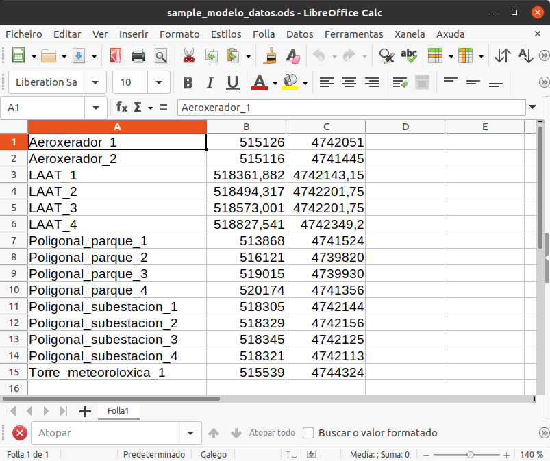
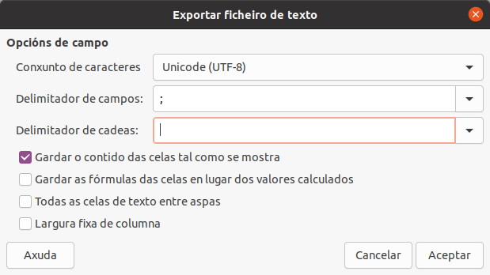
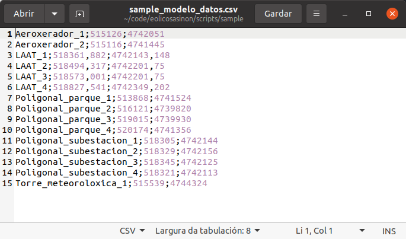
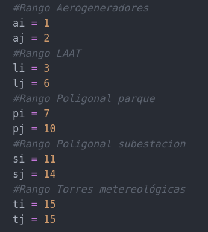
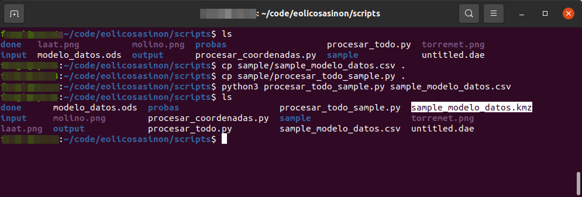
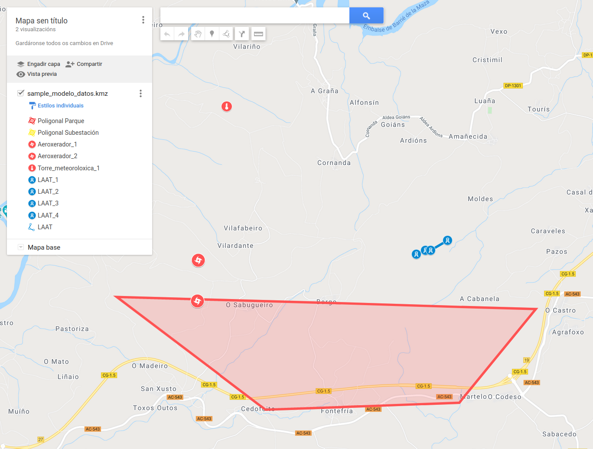

# #eolicosAsiNon
Ferramentas para a defensa do territorio contra os macroparques eolicos

**procesar_todo.py** - O script serve para crear unha visualización dos diferentes elementos dun parque eólico (aeroxeneradores, liñas de alta tensión (LAAT), poligonais, ...) a partir dos datos publicados no BOE. Os datos extráense de xeito manual desde a publicación do BOE e gárdanse nunha folla de cálculo. O script traduce as coordenadas dos diferentes elementos, en formato EPSG:25829, a formato EPSG:4326, e crea un ficheiro KMZ que se pode importar en ferramentas como Google Maps ou Google Eearth.

## Uso

1. Utiliza unha folla de cálculo para almacenar todos os datos de coordenadas do parque.
2. Exporta o documento a un ficheiro de texto con valores separados por comas (CSV).
3. Configura o script "procesar_todo.py" indicando os rangos dos diferentes elementos do mapa.
4. Executa o script sobre o teu ficheiro de datos en csv.

Executar o script:

    python3 procesar_todo.py ficheiro_de_datos.csv

## Configuración do equipo

Para executar o script debes ter instalado **python3**, así como algunhas librarías adicionais e outras ferramentas como **git** para descargar o código.

Como exemplo proponse unha instalación predeterminada da distribución gnu/Linux Ubuntu 20.04.

### Python

Esta distribución trae instalado python de xeito predeterminado. Podes comprobar a versión escribindo o seguinte código:

    usuario@maquina:~$ python3 --version
    Python 3.8.5

En caso de que non estea instalado podes instalalo coas seguintes ordes:

    usuario@maquina:~$ sudo apt-get update
    usuario@maquina:~$ sudo apt-get install python3

Será necesario que instales algunhas librarías extra para poder executar o script. Podes facelo coa ferramenta **pip**.

    usuario@maquina:~$ sudo apt-get install python3-pip

    usuario@maquina:~$ pip3 install simplekml
    usuario@maquina:~$ pip3 install numpy
    usuario@maquina:~$ pip3 install geopandas
    usuario@maquina:~$ pip3 install pyproj

### Git

Comproba se a ferramenta git está instalada:

    usuario@maquina:~$ git --version
    git version 2.25.1

En caso de que non estea instalado podes instalalo coas seguintes ordes:

    usuario@maquina:~$ sudo apt-get update
    usuario@maquina:~$ sudo apt-get install git

## Exemplo

No directorio "sample" tes algúns ficheiros que te poden axudar a entender como funciona o script

1. Todos os datos do parque eólico poden engadirse nun único ficheiro de folla de cálculo como LibreOffice, utilizando unicamente tres columnas.

2. Ademais de gardar a folla de cálculo no seu formato orixinal é necesario exportar os datos a un ficheiro de texto con valores separados por comas (CSV). LibreOffice permite configurar o filtro de exportación, de xeito que cada valor estea delimitado por punto e coma (;) e non se utilice ningún carácter para delimitar as cadeas.

3. O resultado da exportación é un ficheiro CSV coma o seguinte. (A numeración que se ve á esquerda é parte do programa de visualización e non forma parte do ficheiro.)

4. Antes de executar o script sobre os datos é necesario configurar os rangos onde se encontran os datos (a numeración que se pode ver na marxe esquerda na imaxe anterior).

5. Execución dos datos de exemplo

Código:

    cd scripts #entrar no directorio onde está o código
    cp sample/sample_modelo_datos.csv . #copiar os datos do exemplo ao directorio de execución
    cp sample/procesar_todo_sample.py . #copiar o script configurado para o exemplo no directorio de execución
    python3 procesar_todo_sample.py sample_modelo_datos.csv #executar o script

6. Unha vez executado o script obtense un ficheiro KMZ que se pode importar nas ferramentas de mapas de Google. O resultado do exemplo pode verse na imaxe.

